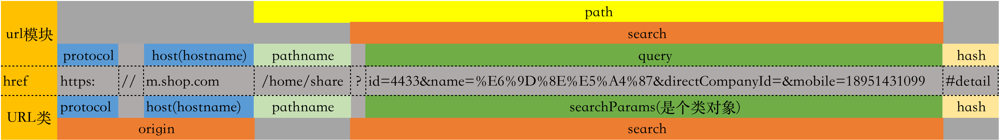

对于一个url: `const urlStr = "https://m.shop.com/home/share?id=4433&name=%E6%9D%8E%E5%A4%87&directCompanyId=&mobile=18951431099#detail"`

```JavaScript
import url from 'url';
import qs from 'querystring'

const url = url.parse(urlStr)
const query = qs.parse(url.query)
```
如果你在nodejs 11.0以后的版本上使用,编译器会提示`已过期`(`since v11.0.0 - Use the WHATWG URL API`),并推荐你使用`URL`.

这是因为nodejs的`url.parse`方法采用的传统的`urlObject`,不符合[URL现存标准-WHATWG URL API](https://url.spec.whatwg.org/#goals),因此弃用了。同时

    `WHATWG`是国际权威的技术标准组织

使用`URL`类对url进行操作,[详细文档见](http://nodejs.cn/api/url.html#url_the_whatwg_url_api)
```JavaScript
const url1 = new URL(urlStr)
const name: string = url1.searchParams.get('name');
```

## 对比`url模块`和URL类
分析上面的url

属性          |url模块|URL类
--|--|--
protocol     |`✅`  | `✅`
host         |`✅`  | `✅`
port         |`✅`  | `✅`
hostname     |`✅`  | `✅`
search       |`✅`  | `✅`
query        |`✅`  | `-`
path         |`✅`  | `-`
pathname     |`✅`  | `✅`
href         |`✅`  | `✅`
hash         |`✅`  | `✅`
origin       | -    | `✅`

可以看出来，只有三个字段不同



打印两个对象的输出
```json
// url
{
  protocol: 'https:',
  slashes: true,
  auth: null,
  host: 'm.shop.com',
  port: null,
  hostname: 'm.shop.com',
  hash: '#detail',
  search: '?id=4433&name=%E6%9D%8E%E5%A4%87&directCompanyId=&mobile=18951431099',
  query: 'id=4433&name=%E6%9D%8E%E5%A4%87&directCompanyId=&mobile=18951431099',
  pathname: '/home/share',
  path: '/home/share?id=4433&name=%E6%9D%8E%E5%A4%87&directCompanyId=&mobile=18951431099',
  href: 'https://m.shop.com/home/share?id=4433&name=%E6%9D%8E%E5%A4%87&directCompanyId=&mobile=18951431099#detail'
}
// URL
{
  href: 'https://m.shop.com/home/share?id=4433&name=%E6%9D%8E%E5%A4%87&directCompanyId=&mobile=18951431099#detail',
  origin: 'https://m.shop.com',
  protocol: 'https:',
  username: '',
  password: '',
  host: 'm.shop.com',
  hostname: 'm.shop.com',
  port: '',
  pathname: '/home/share',
  search: '?id=4433&name=%E6%9D%8E%E5%A4%87&directCompanyId=&mobile=18951431099',
  searchParams: URLSearchParams {
    'id' => '4433',
    'name' => '李备',
    'directCompanyId' => '',
    'mobile' => '18951431099' },
  hash: '#detail'
}
```

**参考文献：**
- 1. [URL API](http://nodejs.cn/api/url.html#url_the_whatwg_url_api)
- 2. [nodejs的url模块](http://nodejs.cn/api/deprecations.html#deprecations_dep0116_legacy_url_api)